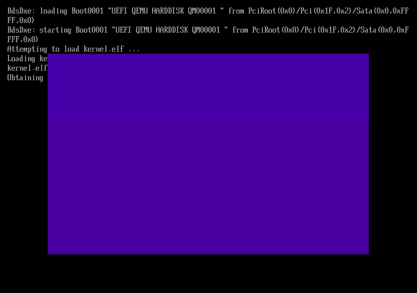

# Rusty OS

[](https://sunsided.github.io/os/)
[](https://github.com/sunsided/os/actions/workflows/build-kernel.yaml)
[](https://github.com/sunsided/os/actions/workflows/build-uefi.yaml)

A toy x86-64 operating system written in Rust, using UEFI to boot and load a kernel image.



## Table of Contents

<!-- START doctoc generated TOC please keep comment here to allow auto update -->
<!-- DON'T EDIT THIS SECTION, INSTEAD RE-RUN doctoc TO UPDATE -->

  - [Features](#features)
  - [Building the Project](#building-the-project)
    - [Quick Start](#quick-start)
    - [Rust targets](#rust-targets)
    - [Pitfalls for Compiling](#pitfalls-for-compiling)
    - [Example Build Commands](#example-build-commands)
- [Related Projects](#related-projects)
- [License](#license)

<!-- END doctoc generated TOC please keep comment here to allow auto update -->

## Features

* [x] UEFI bootloader
* [x] Kernel image loading
* [x] Basic memory management
* [x] APIC timer interrupt calibrated on TSC
* [ ] Basic I/O
* [ ] Basic process management
* [ ] Basic file system
* [ ] Basic shell
* [ ] Basic networking
* [x] Basic UEFI GOP framebuffer
* [ ] Basic graphics
* [ ] Basic audio

## Building the Project

### Quick Start

To build and run the project on QEMU, use:

```shell
task qemu
# or
task qemu PROFILE=release
```

### Rust targets

To build for UEFI and plain ELF you'll need the following:

```shell
rustup target add x86_64-unknown-uefi
rustup target add x86_64-unknown-none
```

For a simplified experience, run

```shell
task setup
```

### Pitfalls for Compiling

The workspace targets require different target architectures, for example `x86_64-unknown-uefi` for
the UEFI loader package. At this moment, `cargo build`
cannot be configured for per-package targets, so
using `cargo build` from the workspace root is bound to
fail.

For the easiest build path, use `task build` instead
of `cargo build`, or use any of the aliases defined
in [`.cargo/config.toml`](.cargo/config.toml) (such
as `cargo uefi-dev`).

### Example Build Commands

```sh
task build:uefi
cargo uefi
task build
```

Or, manually:

```sh
cargo build --package uefi-loader --target x86_64-unknown-uefi
```

# Related Projects

* The [ruefi](https://github.com/sunsided/ruefi) project is the spiritual parent of this repo.

# License

Licensed under the European Union Public Licence (EUPL), Version 1.2.
